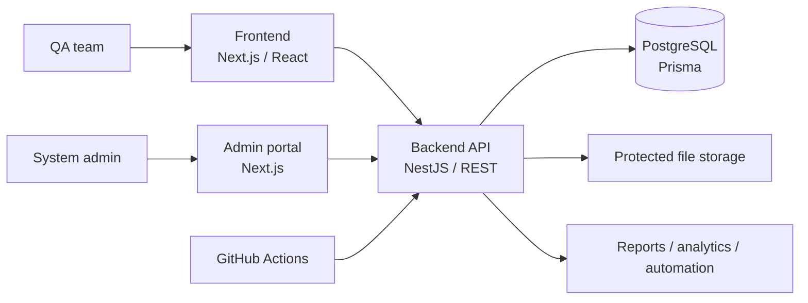

# Quality Hub

<div align="center">
  <h3>Quality intelligence for teams that ship with confidence.</h3>
  <p>Единое рабочее пространство для тест-кейсов, запусков, дефектов, аналитики и отчётности.</p>
  <p>
    <a href="https://github.com/xwvwww/Quality-Hub/actions/workflows/quality.yml"></a>
    
    
    
    
  </p>
</div>

---

## What is Quality Hub?

Quality Hub помогает QA-командам держать весь цикл качества в одном месте: от требований и тест-дизайна до выполнения, дефектов, трассируемости и управленческой аналитики.

Платформа рассчитана на multi-tenant рабочие пространства с разграничением ролей, аудитом действий, защищёнными сессиями и отдельным системным администрированием.

## Product Surface

| Area | What it covers |
|---|---|
| **Workspace** | Проекты, команды, требования и окружения |
| **Test design** | Версионируемые тест-кейсы, шаги, папки, шаблоны и теги |
| **Execution** | Тест-планы, тест-раны, результаты шагов, блокировки и reruns |
| **Defects** | Регистрация дефектов, статусы, Kanban, вложения и связи с кейсами |
| **Insights** | Dashboard, аналитика качества, readiness-метрики и прогнозы |
| **Reports** | PDF/JSON-отчёты, фоновые задачи и экспорт результатов |
| **Automation** | API keys и приём результатов автоматизированных прогонов |
| **Performance** | JMeter-запуски, метрики, сравнения и CI-интеграции |
| **Governance** | Роли, аудит, уведомления, сессии и system administration |

## Architecture



## Technology

- **Frontend:** Next.js 15, React 19, TypeScript, Tailwind CSS
- **Admin portal:** separate Next.js application
- **Backend:** NestJS 11, REST, Swagger, validation and role guards
- **Data:** PostgreSQL 16, Prisma ORM and migrations
- **Quality gates:** Jest, Playwright, TypeScript, GitHub Actions
- **Security:** Argon2 password hashing, short-lived access tokens, rotated refresh sessions, HttpOnly cookies, tenant scoping and audit logging

## Repository Layout

```text
apps/
  frontend/    Main QA workspace
  admin/       System administration portal
  backend/     NestJS API and Prisma schema
e2e/           Playwright scenarios
scripts/       Backup and restore helpers
.github/       CI workflow
```

## Quick Start

### Prerequisites

- Node.js 22 or newer
- Corepack with pnpm 9+
- PostgreSQL 16

### Setup

```powershell
corepack enable
corepack pnpm install
Copy-Item .env.example .env
corepack pnpm run db:generate
corepack pnpm run db:migrate
```

Configure `.env` locally with your own secrets and database values. Never commit `.env`, production credentials, access tokens, private keys, or real user data.

### Run locally

Start each service in a separate terminal:

```powershell
corepack pnpm --filter backend dev
corepack pnpm --filter frontend dev
corepack pnpm run dev:admin
```

Local endpoints:

- Workspace: `http://localhost:3000`
- Admin portal: `http://localhost:3001`
- API: `http://localhost:4000/api`
- Swagger in development: `http://localhost:4000/api/docs`

Seed data is intended for local development only. Use non-production credentials and do not expose seeded accounts publicly.

## Quality Checks

```powershell
corepack pnpm typecheck
corepack pnpm test
corepack pnpm build
corepack pnpm audit --prod --audit-level high
```

End-to-end tests require the services and test database described in [START.md](START.md).

## Security and Privacy

- Keep `.env` files, logs, uploads, backups and generated reports outside commits.
- Use unique secrets for every environment; the values in `.env.example` are placeholders for local setup only.
- Do not add customer data, real email addresses, passwords, tokens, API keys, database dumps or private screenshots to the repository.
- Report a suspected vulnerability privately through a verified repository-owner contact channel. Do not include credentials or personal data in a public issue.

## Documentation

- [Local setup and troubleshooting](START.md)
- [Proprietary license](LICENSE)
- [Quality Hub CI](.github/workflows/quality.yml)

## Ownership

Quality Hub was created and developed by **Almen Alnur**.

Copyright (c) 2026 Almen Alnur. All rights reserved.

The source code, interface, visual language, documentation and brand materials are proprietary. See [LICENSE](LICENSE) for the complete terms.

## License

Quality Hub is distributed under a proprietary license. Viewing the repository does not grant rights to copy, modify, distribute, host, sell or commercially use the Software without prior written permission. See [LICENSE](LICENSE).
