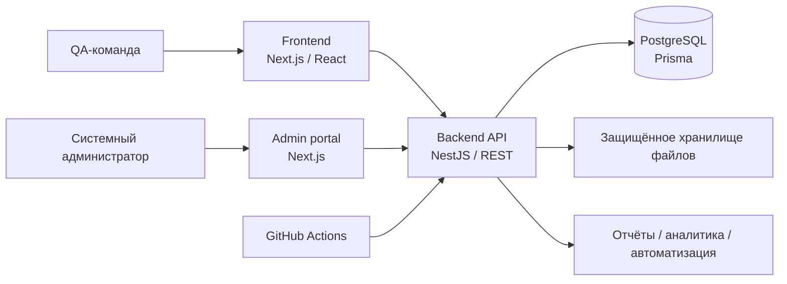

# Quality Hub

<div align="center">
  <h3>Управление качеством для команд, которые выпускают продукт уверенно.</h3>
  <p>Единое рабочее пространство для тест-кейсов, запусков, аналитики и отчётности.</p>
  <p>
    <a href="https://github.com/xwvwww/Quality-Hub/actions/workflows/quality.yml"></a>
    
    
    
    
  </p>
</div>

---

## О Quality Hub

Quality Hub помогает QA-командам держать весь цикл качества в одном месте: от требований и тест-дизайна до выполнения, трассируемости и управленческой аналитики.

Платформа рассчитана на изолированные рабочие пространства с разграничением ролей и отдельным системным администрированием.

## Возможности платформы

| Раздел | Возможности |
|---|---|
| **Рабочее пространство** | Проекты, команды, требования и окружения |
| **Тест-дизайн** | Версионируемые тест-кейсы, шаги, папки, шаблоны и теги |
| **Выполнение** | Тест-планы, тест-раны, результаты шагов, блокировки и повторные запуски |
| **Аналитика** | Dashboard, метрики готовности к релизу и прогнозы |
| **Отчёты** | PDF/JSON-отчёты, фоновые задачи и экспорт результатов |
| **Автоматизация** | API keys и приём результатов автоматизированных прогонов |
| **Производительность** | JMeter-запуски, метрики, сравнения и CI-интеграции |
| **Управление** | Роли, аудит, уведомления, сессии и системное администрирование |

## Архитектура



## Технологии

- **Frontend:** Next.js 15, React 19, TypeScript, Tailwind CSS
- **Admin portal:** отдельное приложение на Next.js
- **Backend:** NestJS 11, REST, Swagger, валидация и guards ролей
- **Данные:** PostgreSQL 16, Prisma ORM и миграции
- **Контроль качества:** Jest, Playwright, TypeScript, GitHub Actions

## Структура репозитория

```text
apps/
  frontend/    Основное QA-пространство
  admin/       Портал системного администрирования
  backend/     NestJS API и Prisma-схема
e2e/           Сценарии Playwright
scripts/       Скрипты резервного копирования и восстановления
.github/       CI workflow
```

## Быстрый запуск

### Требования

- Node.js 22 или новее
- Corepack с pnpm 9+
- PostgreSQL 16

### Установка

```powershell
corepack enable
corepack pnpm install
Copy-Item .env.example .env
corepack pnpm run db:generate
corepack pnpm run db:migrate
```

Настройте локальное окружение на основе `.env.example`.

### Локальный запуск

Запустите каждый сервис в отдельном терминале:

```powershell
corepack pnpm --filter backend dev
corepack pnpm --filter frontend dev
corepack pnpm run dev:admin
```

Локальные адреса:

- Рабочее пространство: `http://localhost:3000`
- Административный портал: `http://localhost:3001`
- API: `http://localhost:4000/api`
- Swagger в development: `http://localhost:4000/api/docs`

## Проверки качества

```powershell
corepack pnpm typecheck
corepack pnpm test
corepack pnpm build
corepack pnpm audit --prod --audit-level high
```

Для end-to-end тестов нужны сервисы и тестовая база данных, описанные в [START.md](START.md).

## Документация

- [Локальная настройка и устранение проблем](START.md)
- [Проприетарная лицензия](LICENSE)
- [Quality Hub CI](.github/workflows/quality.yml)

## Авторство

Quality Hub создан и разработан **Almen Alnur**.

Copyright (c) 2026 Almen Alnur. All rights reserved.

Исходный код, интерфейс, визуальный язык, документация и материалы бренда являются проприетарными. Полные условия приведены в [LICENSE](LICENSE).

## Лицензия

Quality Hub распространяется по проприетарной лицензии. Просмотр репозитория не предоставляет права копировать, изменять, распространять, размещать, продавать или коммерчески использовать программное обеспечение без предварительного письменного разрешения. См. [LICENSE](LICENSE).
